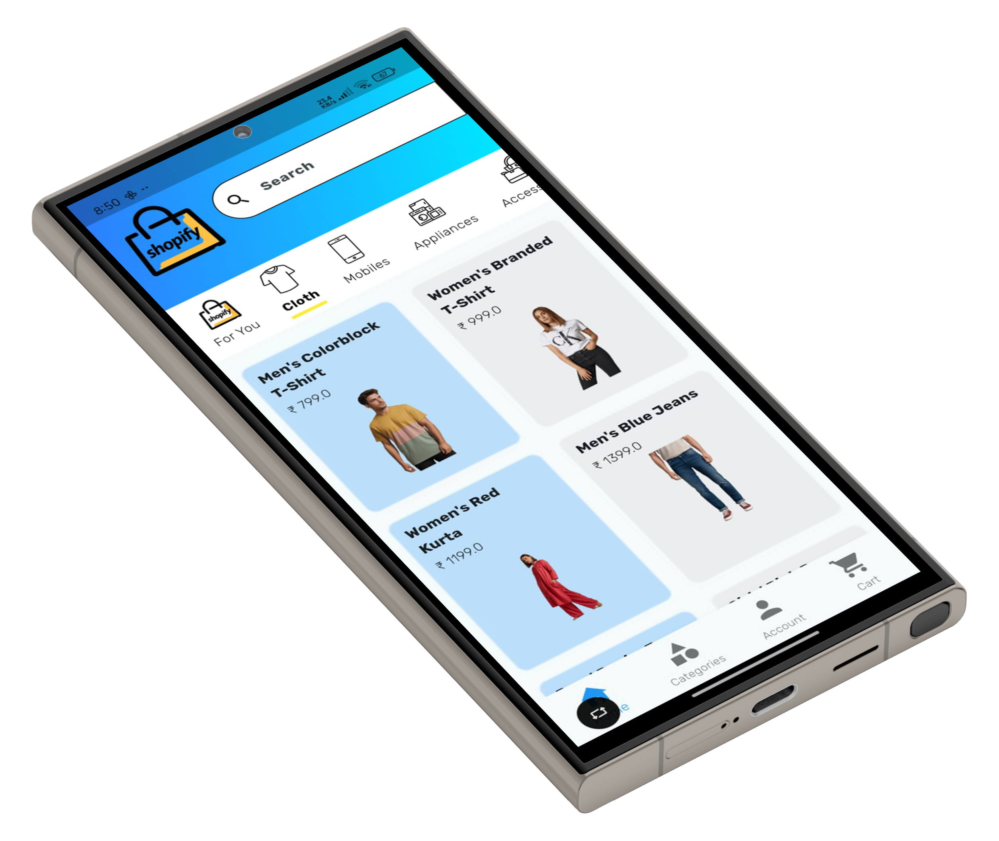

# 🛍️ Shopify - Flutter E-Commerce App

Shopify is a modern, clean, and fully responsive Flutter e-commerce app. It includes categories like Footwear, Accessories, Appliances, and more. Designed to be scalable and easy to integrate with Firebase backend and Node.js server.

---

## 📱 Features

- 🏷️ Product Categories (Clothing, Footwear, Accessories, Appliances, etc.)
- 🛒 Cart functionality
- 🔍 Product Search
- 📦 Product Details with Size Variants
- 🌐 Firebase Firestore Integration (Coming Soon)
- ☁️ Firebase Storage for Images (Coming Soon)
- 🧠 Provider State Management
- ✨ Clean and modular code structure

---

## 📁 Folder Structure

lib/
├── main.dart
├── models/ # Product models, user models
├── providers/ # State management (e.g. CartProvider, ProductProvider)
├── screens/ # UI screens (Home, Cart, Product Details, etc.)
├── services/ # API calls, Firebase logic
├── widgets/ # Reusable UI components
assets/
├── categories/ # All category images
└── icons/ # Category icons

## 📸 Screenshots

### 🏠 Home Page

🛠️ Coming Soon
Firebase Firestore backend integration

Firebase Storage for image hosting

Node.js backend for admin operations

User login & signup

Wishlist & Orders tab

👨‍💻 Author
Your Name – @[yourGitHub](https://github.com/Manish-Patel97/)
