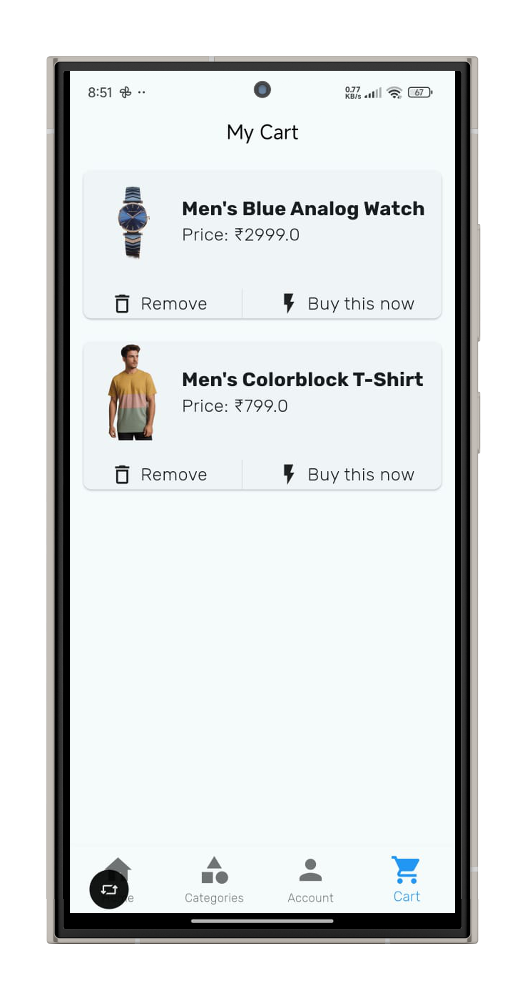
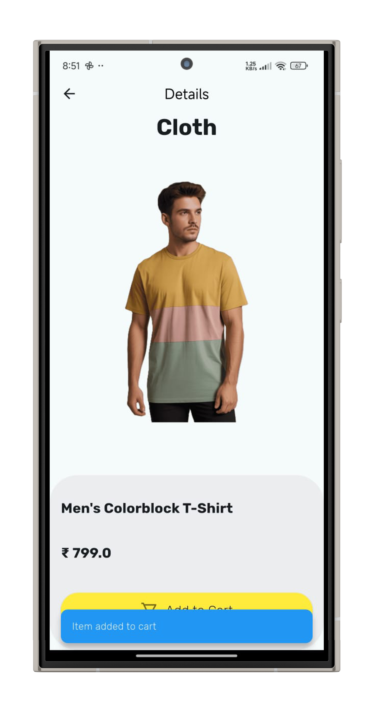

# 🛍️ Shopify - Flutter E-Commerce App

Shopify is a modern, clean, and fully responsive Flutter e-commerce app. It includes rich features like product categories, user authentication, cart management, and more — built using Flutter and Firebase, and structured to scale with backend services like Node.js.

---

## 📱 Features

- 🧍‍♂️ Firebase Authentication (Login & Signup)
- 🏷️ Product Categories (Clothing, Footwear, Accessories, Appliances, etc.)
- 🛒 Add to Cart with Provider State Management
- 📦 Product Details with Size Variants
- 🔍 Product Search (Upcoming)
- ⚙️ Manage Account Section
- ☁️ Firebase Storage for Product Images
- 🔥 Firebase Firestore Integration
- ✨ Clean and modular code structure

---

## 🛠️ Upcoming Features

- 💳 Razorpay/Stripe Payment Gateway Integration
- ❤️ Wishlist Feature
- 📦 Orders Page
- 🌐 Node.js Admin Backend

---

## 📁 Folder Structure

lib/
├── main.dart
├── models/
├── providers/
├── screens/
│   └── login_screens.dart
│   ├── home_page.dart
│   ├── cart_page.dart
│   ├── product_list_page.dart
├── services/
│   └── firebase_auth_methods.dart
├── widgets/
│   ├── login_controller.dart
│   ├── product_card.dart
├── utils/

---

## 📸 Screenshots

  
  
  

---
👨‍💻 Author
Manish Kumar Patel
📫 GitHub Profile

